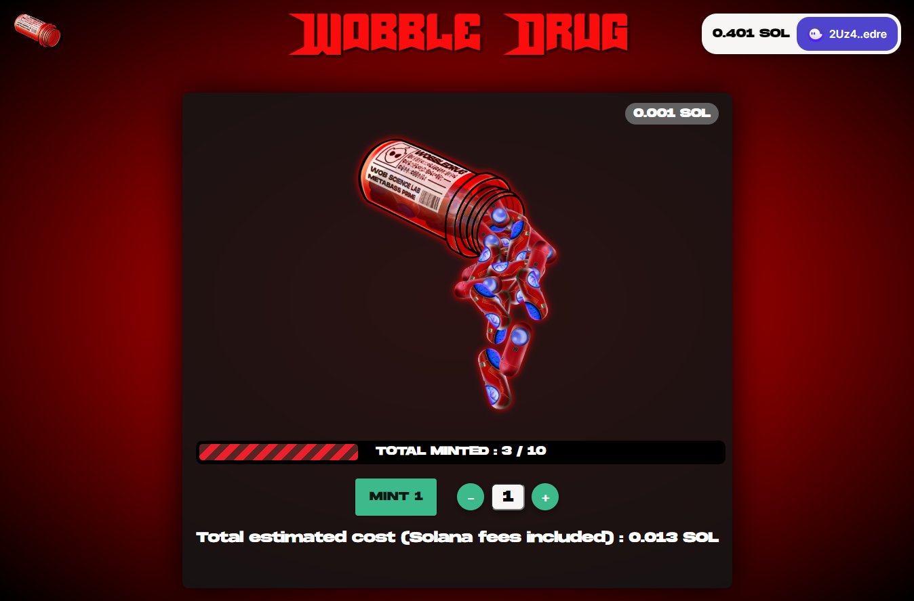

# Introduction

**PROD-READY Candy Machine Responsive UI** which can be easily customized in 5mn.

**UP-TO-DATE with latest Metaplex improvements**

All Candy Machine V2 functionalities are implemented, auto detected and maintained up-to-date :

- Public mint (with countdown when date in future)
- Civic support (gatekeeper)
- Whitelist
- Presale true/false
- End date / end number (endSettings)
- SPL-token to mint
- Latest MCC updates from Metaplex
- Multiple mint



### Supported Wallets


For instructions on how to set up a V2 candy machine, please refer to Metaplex's documentation [here](https://docs.metaplex.com/candy-machine-v2/Introduction)

## To thank me with a small SOL tip :]

`2Uz4LPmj8JJQgMSUwK6RT2ZzcQRrJh2mbYF3iiZfedre`

## Getting Set Up

### Prerequisites

**REQUIRE NODEJS VERSION <= 16 (version 17 not supported)**.

* Download a Code Editor such as Visual Studio Code.

* Ensure you have both `nodejs` and `yarn` installed. `nodejs` recommended version is 16.

* Follow the instructions [here](https://docs.solana.com/cli/install-solana-cli-tools) to install the Solana Command Line Toolkit.

* Follow the instructions [here](https://hackmd.io/@levicook/HJcDneEWF) to install the Metaplex Command Line Utility.
  * Installing the Command Line Package is currently an advanced task that will be simplified eventually.

### Installation

#### 1. Fork the project & clone it. Example:

```
git clone https://github.com/Fulgurus/candy-machine-v2-responsive-ui.git
```

#### 2. Define your environment variables (.env file)

Rename the `.env.example` file at the root directory to `.env` and update the following variables in the `.env` file:

```
REACT_APP_CANDY_MACHINE_ID=__PLACEHOLDER__
```
set __PLACEHOLDER__ with the candy machine pubkey you get once you upload & create your candy machine in Metaplex project. You can find back the value from the `.cache/temp.json` file of your Metaplex project. This file is created when you run the `ts-node candy-machine-v2-cli.ts upload ...` command.

```
REACT_APP_SOLANA_NETWORK=devnet
```

This identifies the Solana network you want to connect to. Options are `devnet`, `testnet`, and `mainnet`.

```
REACT_APP_SOLANA_RPC_HOST=https://api.devnet.solana.com
```

This identifies the RPC server your web app will access the Solana network through.


If you are using a custom SPL Token to MINT, you have two additional environment parameters to set :


```
REACT_APP_SPL_TOKEN_TO_MINT_NAME=
```

Spl-token name to display next the price.

```
REACT_APP_SPL_TOKEN_TO_MINT_DECIMALS=9
```

Spl-token decimals were defined during its creation with --decimals parameter. If you didn't use that parameter, then by default your SPL Token got 9 decimals.

More info about it there : https://spl.solana.com/token

#### 3. Build the project and test. Go to the root project directory and type the commands :

To install dependencies :

```
yarn install
```

To test the app locally in the development mode (localhost:3000) :

```
yarn start
```

To build the production package (generated in build folder of the project) :

```
yarn build
```

##  Available Commands Recap :

### `yarn start`

Runs the app in the development mode.\
Open [http://localhost:3000](http://localhost:3000) to view it in the browser.

The page will reload if you make edits.\
You will also see any lint errors in the console.

### `yarn build`

Builds the app for production to the `build` folder.\
It correctly bundles React in production mode and optimizes the build for the best performance.

The build is minified and the filenames include the hashes.\
Your app is ready to be deployed!

## Need Help ?

You can ask for help in Telegram : https://t.me/fatal_furi
